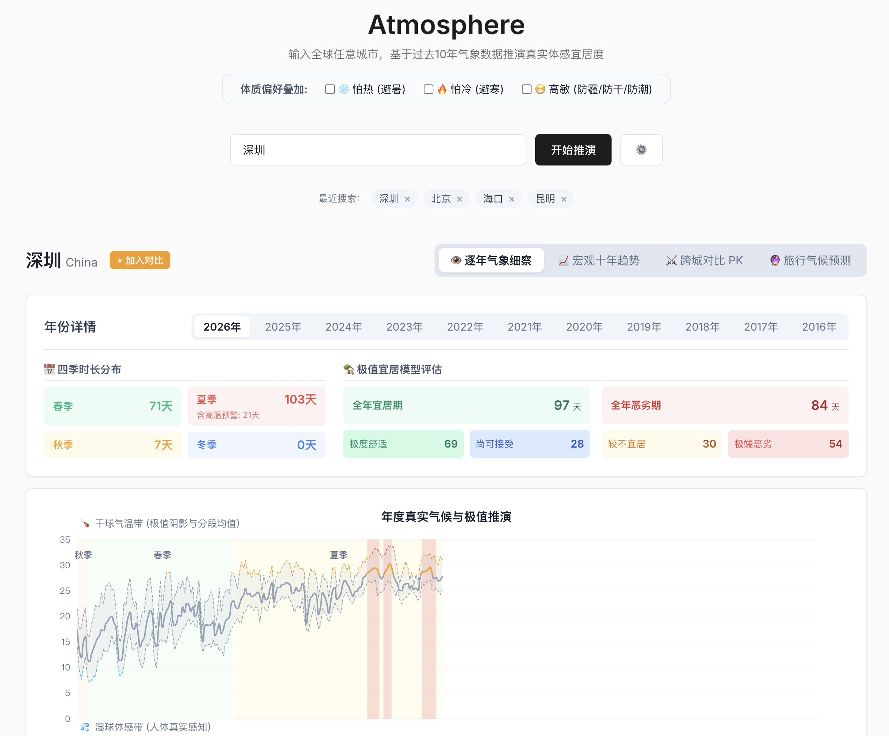
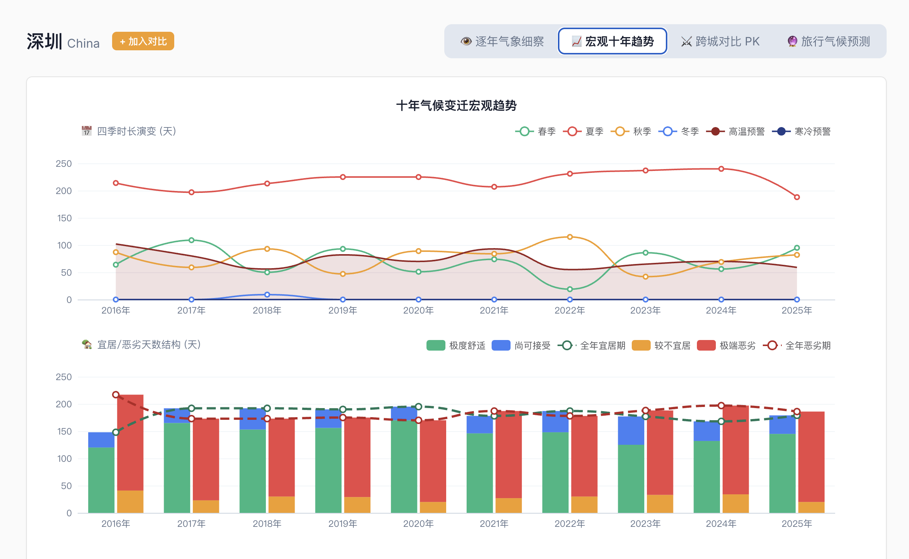
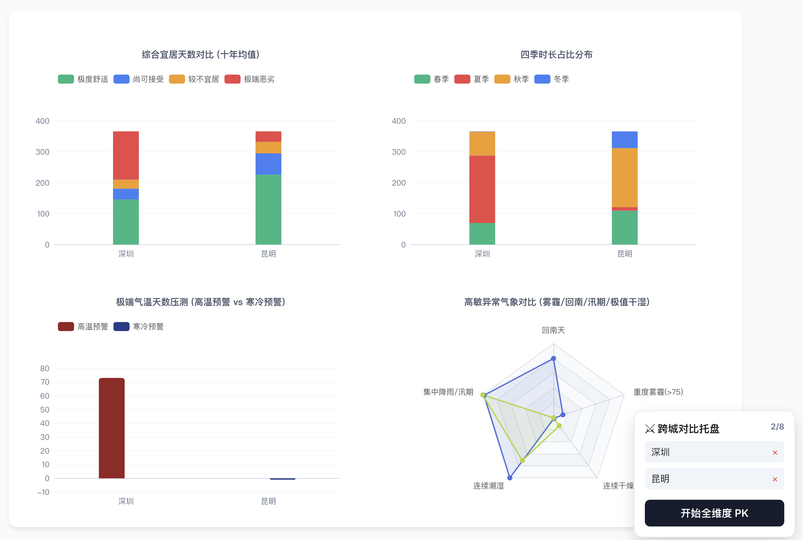
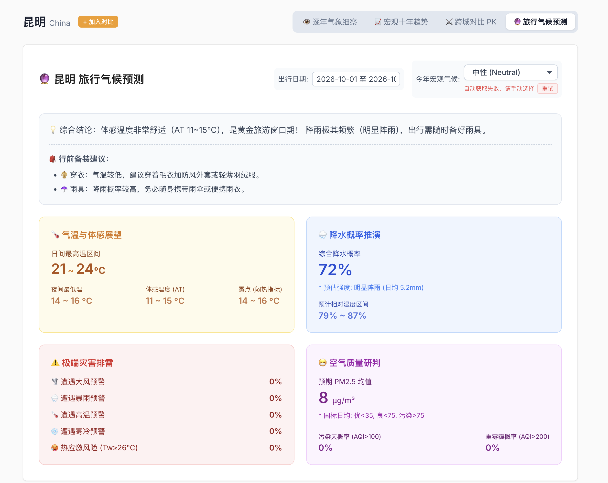

<p align="center">
  
</p>

<h1 align="center">Atmosphere</h1>

<p align="center">
  输入全球任意城市，基于过去十年逐日气象数据推演真实体感宜居度。
</p>

<p align="center">
  <a href="#功能预览">功能预览</a>
  ·
  <a href="#本地开发">本地开发</a>
  ·
  <a href="#数据模型">数据模型</a>
</p>

## 项目定位

Atmosphere 是一个面向城市选择、旅居判断和旅行准备的气候宜居分析仪。它不是传统天气 App，也不只展示月均温这类粗粒度指标，而是把过去十年的逐日历史气象、湿球体感、PM2.5、降水、风速、极端事件和四季转换综合起来，回答一个更实际的问题：

> 这个城市在一年中的哪些时间真正舒服，哪些时间只是平均值看起来不错？

应用支持全球城市搜索、逐年气候细察、近十年趋势、跨城市对比和未来旅行窗口推演。天气、空气质量、地理编码已经前端化，主要分析能力可以直接在浏览器侧完成。

## 功能预览

### 逐年气象细察

按年份查看城市真实气候曲线，包含干球气温、湿球体感、相对湿度、降水、PM2.5、灾害散点和宜居条带。四季不是按自然月份切分，而是根据气温滑动趋势推演。



### 宏观十年趋势

观察近十年四季长度、宜居天数、恶劣天数、高温预警和寒冷预警的变化，适合判断一个城市的长期气候稳定性和极端化趋势。



### 跨城对比 PK

最多加入 8 个城市，从综合宜居天数、四季结构、极端气温、回南天、汛期、连续干湿期和雾霾风险等维度做横向比较。



### 旅行气候预测

选择未来出行日期后，系统会基于历史同日期窗口、年份新近权重和 ENSO 状态，推演气温体感、降水概率、极端灾害、空气质量和行前装备建议。自动获取当前 ENSO 失败时，可在页面内手动选择状态。



## 核心能力

- **真实四季推演**：使用 5 日滑动平均气温估算春夏秋冬转换，避免固定月份带来的误判。
- **极值宜居模型**：把高温、严寒、昼夜温差、湿热、湿冷、干燥、暴雨、大风和 PM2.5 统一折算为宜居等级。
- **体质偏好叠加**：支持怕热、怕冷、高敏三类偏好，对热应激、冷应激、污染和湿度不适进行加权。
- **逐日气候细察**：在同一张图上查看气温、体感、湿度、降水、空气质量和极端事件。
- **十年宏观趋势**：用年际变化判断季节结构、宜居窗口和极端风险是否稳定。
- **跨城对比托盘**：把候选城市加入对比后，集中查看适合居住、避暑、避寒或旅行的差异。
- **旅行窗口推演**：面向未来日期做历史统计预测，给出降雨、体感、灾害和装备建议。
- **响应式体验**：桌面端保留大图表信息密度，移动端调整为更适合触控和纵向阅读的布局。

## 数据模型

Atmosphere 的主要数据链路已经可以脱离自建后端运行：

- **历史天气**：Open-Meteo Archive API
- **空气质量**：Open-Meteo Air Quality API
- **城市地理编码**：Open-Meteo Geocoding API
- **历史 ENSO 年份标签**：内置 NOAA/PSL Oceanic Nino Index (ONI) 年度摘要
- **本地缓存**：历史天气数据缓存在浏览器 IndexedDB，最近搜索和缓存城市列表保存在 localStorage

前端会直接请求 Open-Meteo，并把天气和空气质量聚合成按日数据。当前后端只保留一个可选增强接口：

- `GET /api/enso`：本地开发时获取并解析当前 ENSO 状态。该接口不可用时，旅行预测页会提示用户手动选择 El Nino、La Nina 或 Neutral。

缺少本地后端时，只有“当前 ENSO 自动识别”会降级，其余核心分析能力仍然保留。

## 技术栈

- React 19
- TypeScript
- Vite 8
- ECharts / echarts-for-react
- Express 5
- idb-keyval
- Flatpickr / react-flatpickr
- lucide-react

## 项目结构

```text
.
├── server/
│   └── index.ts                  # 本地辅助 API：ENSO
├── src/
│   ├── api.ts                    # Open-Meteo 请求、缓存、日级聚合
│   ├── App.tsx                   # 页面状态、城市搜索、视图切换、对比托盘
│   ├── components/
│   │   ├── ClimateChart.tsx      # 单年气候细察图
│   │   ├── TrendChart.tsx        # 十年宏观趋势
│   │   ├── CompareDashboard.tsx  # 跨城对比
│   │   └── Predictor.tsx         # 旅行气候预测
│   ├── data/
│   │   └── ensoYears.ts          # 内置历史 ENSO 年度摘要
│   ├── hooks/
│   │   └── useMediaQuery.ts      # 响应式视口判断
│   ├── utils/
│   │   ├── analyzer.ts           # 湿球、露点、体感、四季和宜居评分
│   │   └── predictor.ts          # 日期窗口预测和 ENSO 权重
│   ├── App.css
│   ├── index.css
│   └── main.tsx
├── public/
│   └── readme/                   # README 展示素材
├── vite.config.ts                # Vite 配置；/api/enso 代理到本地 Express
└── package.json
```

## 本地开发

```bash
npm install
npm run dev
```

默认会同时启动：

- 前端：`http://localhost:5173/`
- 后端：`http://127.0.0.1:3000/`

也可以拆开启动：

```bash
npm run dev:frontend
npm run dev:backend
```

## 构建

```bash
npm run build
npm run preview
```

构建产物会输出到 `dist/`，可通过 `npm run preview` 在本地预览。

## 实现边界

- 预测模块是历史统计推演，不等同于实时天气预报。
- PM2.5 数据缺失时会自动降级为空值，不阻断主天气分析。
- 中文城市名会先尝试翻译，再查询 Open-Meteo Geocoding；个别同名城市可能需要用户从结果中判断。
- 当前 ENSO 自动获取仍依赖本地后端增强，因为官方 ENSO 数据源在浏览器直连时没有稳定 CORS 支持或需要登录。
- 如果未来第三方 API 的 CORS 策略变化，可以把对应请求恢复成 serverless proxy。

## License

MIT
