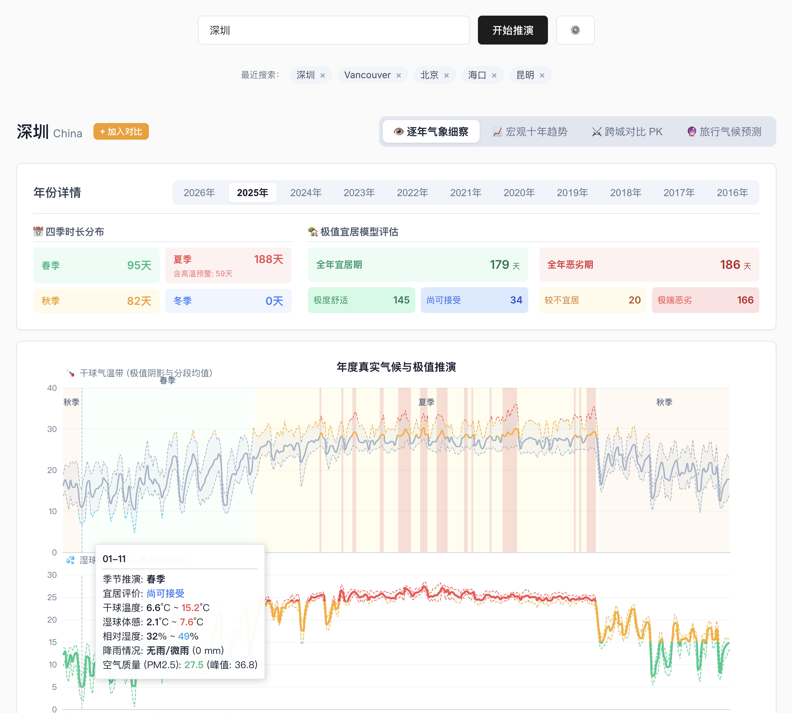

# Atmosphere

Atmosphere 是一个面向城市选择、旅居判断和旅行准备的气候宜居分析仪。它不只展示天气均值，而是把过去十年的逐日历史气象、湿球体感、PM2.5、降水、风速和季节转换综合起来，推演一个城市在不同年份、不同日期窗口下的真实居住和出行体验。

当前界面以城市搜索为入口。用户输入城市后，可以查看单年气候细察、十年宏观趋势、跨城市对比和旅行气候预测。截图中的深圳示例展示了 2025 年四季时长、宜居/恶劣天数结构，以及干球温度、湿球体感、湿度、降水、空气质量和极端灾害标记。



## 核心能力

- **逐年气象细察**：按年份查看城市真实气候曲线，包含干球温度、湿球体感、相对湿度、降水、PM2.5、灾害散点和宜居条带。
- **真实四季推演**：使用 5 日滑动平均气温估算春夏秋冬转换，而不是直接按自然月份切分。
- **极值宜居模型**：将高温、严寒、昼夜温差、湿热/湿冷、干燥、暴雨、大风和 PM2.5 统一折算为宜居等级。
- **体质偏好叠加**：支持怕热、怕冷、高敏三类偏好，对热应激、冷应激、污染和湿度不适进行加权。
- **十年宏观趋势**：观察近十年四季长度、极端高温/寒冷天数、宜居天数和恶劣天数的变化。
- **跨城对比 PK**：最多加入 8 个城市，对比宜居天数、四季结构、极端温度、回南天、汛期、连续干湿期和雾霾风险。
- **旅行气候预测**：选择未来出行日期，基于历史同日期窗口、年份新近权重和 ENSO 状态生成气温、体感、降雨、灾害和空气质量预估。
- **本地缓存**：历史天气数据缓存在浏览器 IndexedDB，最近搜索和缓存城市列表保存在 localStorage。

## 数据来源

- **历史天气**：Open-Meteo Archive API
- **空气质量**：Open-Meteo Air Quality API
- **城市地理编码**：Open-Meteo Geocoding API
- **历史 ENSO 年份标签**：内置 NOAA/PSL Oceanic Nino Index (ONI) 年度摘要
- **当前 ENSO 状态**：本地开发时可通过 NOAA CPC Nino 3.4 文本数据自动获取

天气、空气质量和城市地理编码已经前端直连外部数据源，不再经过本地 `/api/weather` 或 `/api/geocoding` 代理。历史 ENSO 年份标签已内置到前端，静态部署也能完整参与预测权重。当前后端只保留一个可选增强接口：

- `GET /api/enso`：本地开发时获取并解析当前 ENSO 状态；失败或静态部署无后端时，预测页会提示用户手动选择。

## 技术栈

- React 19
- TypeScript
- Vite
- ECharts / echarts-for-react
- Express
- idb-keyval
- Flatpickr

## 项目结构

```text
.
├── server/
│   └── index.ts              # 本地辅助 API：ENSO
├── src/
│   ├── api.ts                # 前端数据请求、Open-Meteo 直连、IndexedDB 缓存、日级聚合
│   ├── App.tsx               # 页面状态、城市搜索、视图切换、对比托盘
│   ├── components/
│   │   ├── ClimateChart.tsx      # 单年气候细察图
│   │   ├── TrendChart.tsx        # 十年宏观趋势
│   │   ├── CompareDashboard.tsx  # 跨城对比
│   │   └── Predictor.tsx         # 旅行气候预测
│   ├── data/
│   │   └── ensoYears.ts      # 内置历史 ENSO 年度摘要
│   ├── utils/
│   │   ├── analyzer.ts       # 湿球温度、露点、体感温度、四季和宜居评分
│   │   └── predictor.ts      # 日期窗口预测和 ENSO 权重
│   ├── index.css             # 全局样式
│   └── main.tsx              # React 入口
├── public/
├── vite.config.ts            # Vite 配置；/api/enso 代理到本地 Express
└── package.json
```

## 本地开发

```bash
npm install
npm run dev
```

默认会同时启动：

- 前端：`http://localhost:5173/`
- 后端：`http://127.0.0.1:3000/`

也可以拆开启动：

```bash
npm run dev:frontend
npm run dev:backend
```

## 构建

```bash
npm run build
npm run preview
```

构建产物使用相对资源路径，可以部署到 GitHub Pages 等静态站点。静态部署没有 `/api/enso` 时，旅行预测仍会使用内置历史 ENSO 年份数据，只是当前年份 ENSO 状态需要用户在页面上手动选择。

## 当前实现边界

- 天气和空气质量已经浏览器直连 Open-Meteo；如果未来部署环境出现第三方 CORS 限制，可以再把对应请求恢复成 serverless proxy。
- 地理编码已经前端化：中文城市名会先尝试 MyMemory 翻译，再查询 Open-Meteo Geocoding。
- 历史 ENSO 年份标签已内置；当前 ENSO 自动获取仍走本地后端增强，因为实测 NOAA/PSL/ERDDAP 等官方源在浏览器直连时都没有稳定 CORS 支持或需要登录。
- PM2.5 数据缺失时会自动降级为空值，不阻断主天气分析。
- 预测模块是历史统计推演，不等同于实时天气预报。

## License

MIT
