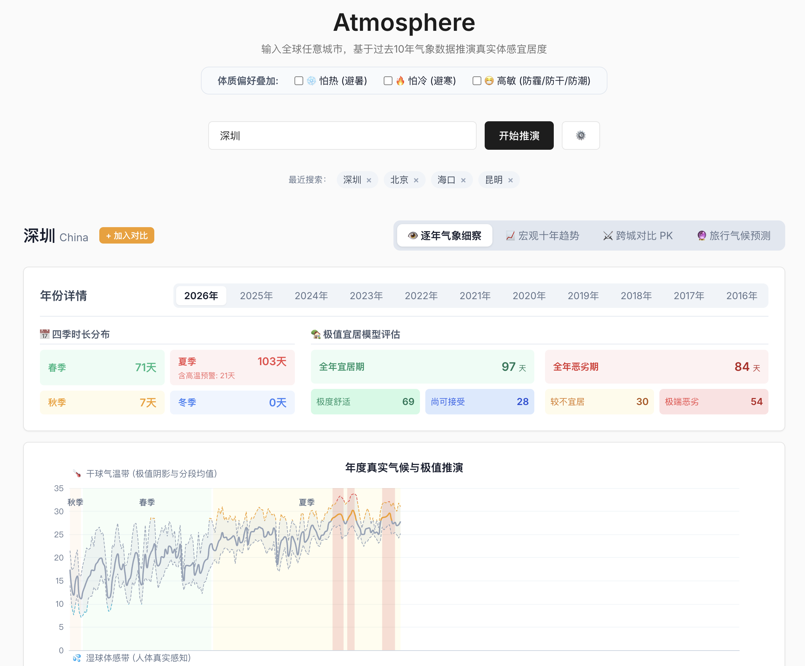
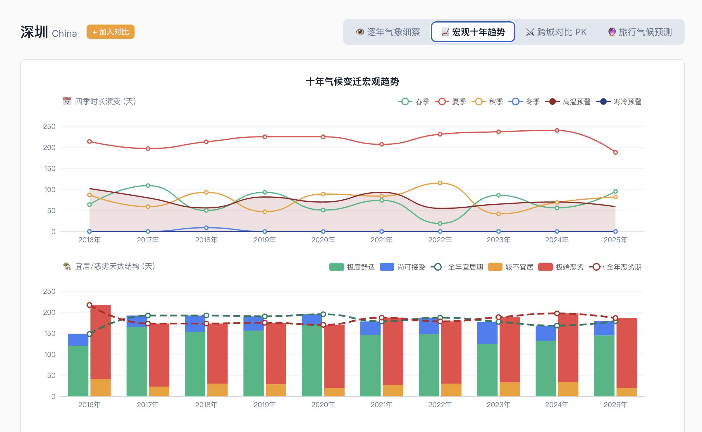
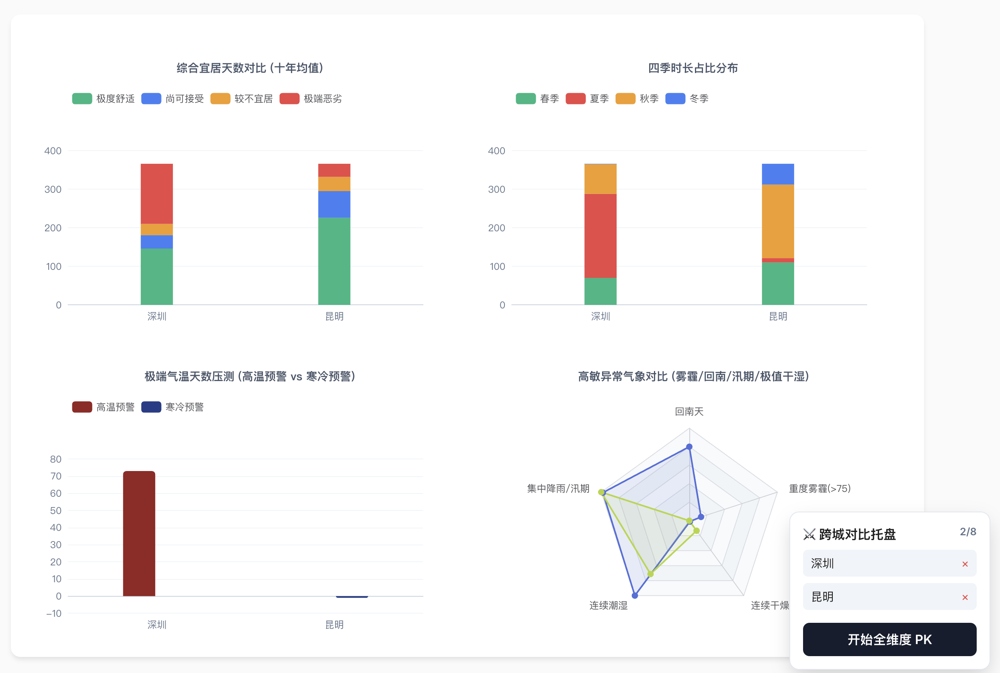
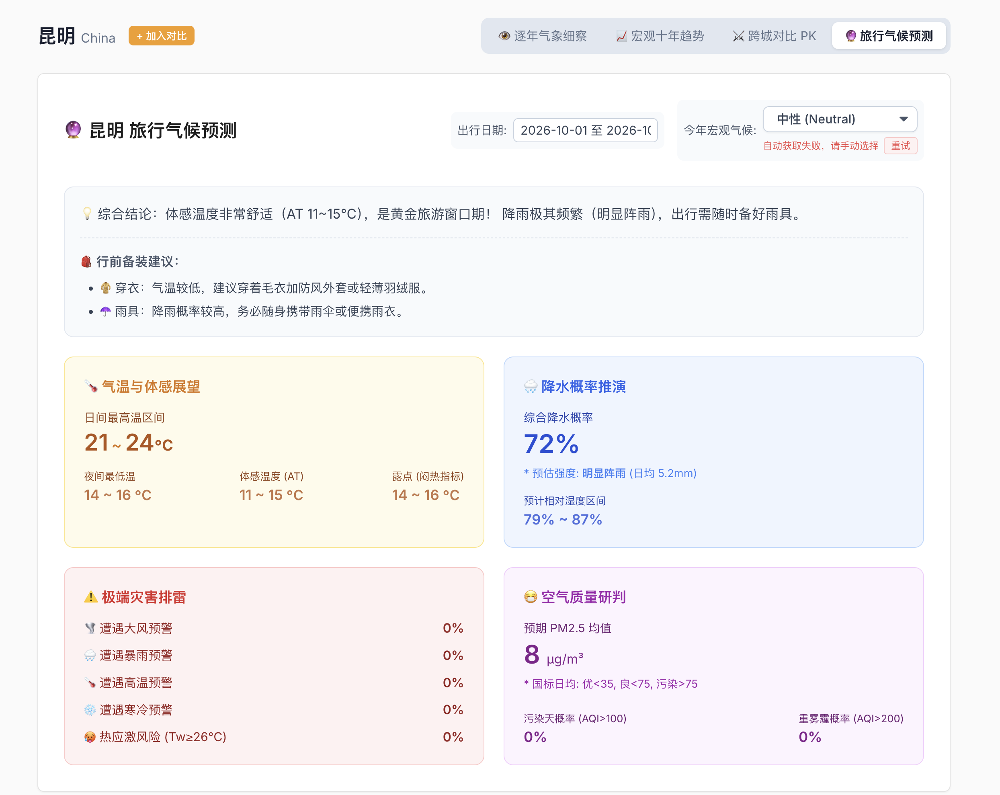

<p align="center">
  
</p>

# Atmosphere

[中文](#中文) · [English](#english)

---

<a id="中文"></a>

## 中文

Atmosphere 是一个基于历史天气数据的城市气候分析工具。它按日整理近十年的气温、湿度、降水、风速和 PM2.5，用于查看年度变化、长期趋势、城市差异和指定旅行日期的历史分布。

界面支持中文和英文，可通过 `?lang=zh` 或 `?lang=en` 指定初始语言。网站采用响应式布局，也可以从 Chrome 等支持 PWA 的浏览器安装到桌面或主屏幕。

### 当前功能

- 搜索全球城市并读取 Open-Meteo 历史数据。
- 按年份查看气温、湿球温度、表观温度、湿度、降水、风速、PM2.5、季节划分和宜居等级。
- 汇总近十年的季节长度、宜居天数和高低温变化。
- 同时比较最多 8 个城市。
- 根据历史同期数据、年份权重和 ENSO 状态计算旅行日期的气温范围、降水概率、空气质量和天气风险。
- 按怕热、怕冷和敏感偏好调整宜居评分。

### 界面



*按年查看每日气候数据和计算结果。*



*汇总各年的季节、宜居天数和温度变化。*



*比较多个城市的气候指标。*



*根据历史同期数据计算指定日期范围。*

### 数据与服务

- 历史天气、空气质量和城市地理编码来自 Open-Meteo。
- 中文城市名通过 MyMemory 翻译后提交给 Open-Meteo Geocoding。
- 历史 ENSO 年份标签保存在前端；当前 ENSO 状态由可选的 `GET /api/enso` 接口读取 NOAA CPC 数据。
- 历史天气缓存在 IndexedDB；语言、最近搜索和旅行日期等界面状态保存在 localStorage。

浏览器直接请求历史天气、空气质量和地理编码。Express 服务只提供当前 ENSO 状态；该接口不可用时，旅行日期页面允许手动选择 ENSO 状态。

### 运行开发版

```sh
npm install
npm run dev
```

默认地址：

- 前端：`http://localhost:5173/`
- ENSO 接口：`http://127.0.0.1:3000/`

也可以分别启动：

```sh
npm run dev:frontend
npm run dev:backend
```

生产构建和本地预览：

```sh
npm run build
npm run preview
```

构建产物位于 `dist/`。

### 当前限制

- 当前数据范围是历史日值，页面未接入实时天气和预报数据。季节、宜居等级和旅行日期结果由历史数据与项目内规则计算，用作统计参考。
- PM2.5 数据缺失时保持为空，天气分析仍可继续。
- 地理编码当前使用第一个匹配结果；同名城市需要核对地区和国家。
- 当前 ENSO 自动识别依赖本地 Express 接口，接口不可用时使用手动选择。
- 安装版仍通过网络加载页面和第三方数据。IndexedDB 只保存已经读取的历史天气。

### 代码导航

- [src/api.ts](src/api.ts)：外部数据请求、缓存和日级整理
- [src/utils/analyzer.ts](src/utils/analyzer.ts)：体感、季节和宜居评分
- [src/utils/predictor.ts](src/utils/predictor.ts)：旅行日期统计
- [src/components](src/components)：图表、城市比较和旅行日期界面
- [src/i18n](src/i18n)：中英文资源与格式化
- [server/index.ts](server/index.ts)：可选的 ENSO 接口

前端使用 React、TypeScript、Vite 和 ECharts；可选服务使用 Express。完整依赖和命令见 [package.json](package.json)。

---

<a id="english"></a>

## English

Atmosphere is a city climate analysis tool based on historical weather data. It organizes roughly ten years of daily temperature, humidity, precipitation, wind, and PM2.5 data for yearly inspection, long-term trends, city comparison, and date-range estimates for travel.

The interface supports Chinese and English. Use `?lang=zh` or `?lang=en` to select the initial language. The responsive web app can also be installed from Chrome and other browsers that support PWAs.

### Current features

- Search for cities worldwide and load historical data from Open-Meteo.
- Inspect temperature, wet-bulb temperature, apparent temperature, humidity, precipitation, wind, PM2.5, season assignments, and livability levels by year.
- Summarize season lengths, livable days, and temperature changes across roughly ten years.
- Compare up to 8 cities.
- Calculate temperature ranges, precipitation probability, air quality, and weather risks for travel dates from historical date matches, year weighting, and ENSO status.
- Adjust livability scoring for heat, cold, and general sensitivity preferences.

### Interface


*Daily climate data and calculated results for one year.*


*Yearly season, livable-day, and temperature summaries.*


*Climate indicators for multiple cities.*


*A selected date range calculated from matching historical dates.*

### Data and services

- Historical weather, air quality, and city geocoding come from Open-Meteo.
- Chinese city names are translated through MyMemory before the Open-Meteo Geocoding request.
- Historical ENSO year labels are bundled with the frontend. The optional `GET /api/enso` endpoint reads the current ENSO state from NOAA CPC data.
- Historical weather is cached in IndexedDB. Language, recent searches, travel dates, and other interface state use localStorage.

The browser requests historical weather, air quality, and geocoding directly. The Express service only supplies the current ENSO status. When that endpoint is unavailable, the travel-date view allows manual ENSO selection.

### Run the development build

```sh
npm install
npm run dev
```

Default addresses:

- Frontend: `http://localhost:5173/`
- ENSO endpoint: `http://127.0.0.1:3000/`

The two processes can also run separately:

```sh
npm run dev:frontend
npm run dev:backend
```

Production build and local preview:

```sh
npm run build
npm run preview
```

Build output is written to `dist/`.

### Current limitations

- The current data scope is daily history, with no current-condition or forecast feed. Season assignments, livability levels, and travel-date results are calculated from historical data and repository-defined rules as statistical references.
- Missing PM2.5 data remains empty while weather analysis continues.
- Geocoding currently uses the first result. Ambiguous city names require checking the region and country.
- Automatic current ENSO detection depends on the local Express endpoint. Manual selection is available when the endpoint cannot be reached.
- The installed app loads the page and third-party data over the network. IndexedDB only stores historical weather that has already been loaded.

### Code map

- [src/api.ts](src/api.ts): external data requests, caching, and daily aggregation
- [src/utils/analyzer.ts](src/utils/analyzer.ts): apparent conditions, seasons, and livability scoring
- [src/utils/predictor.ts](src/utils/predictor.ts): travel-date calculations
- [src/components](src/components): charts, city comparison, and travel-date interface
- [src/i18n](src/i18n): Chinese and English resources and formatting
- [server/index.ts](server/index.ts): optional ENSO endpoint

The frontend uses React, TypeScript, Vite, and ECharts. The optional service uses Express. See [package.json](package.json) for dependencies and commands.

## License

MIT
